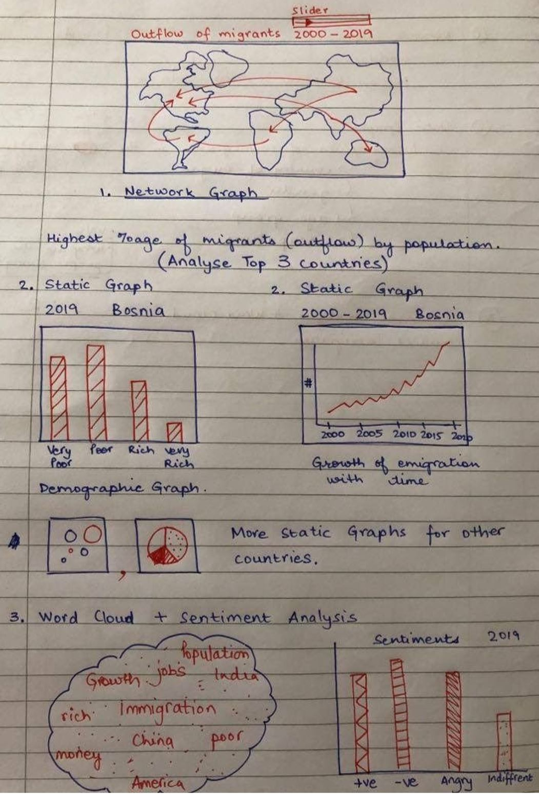

### Title: The Story of Immigrants

### Abstract: 
This project aims to highlight the trends and facts about immigration around world with a particular focus in the top outflow and inflow countries.  

### Technique: 
Our project will focus on the countries which have the highest outflow of immigrant population. We will analyse the economic and demographic factors of the top three countries which have the highest migrant outflow. We will also analyse the reasons that force a person to leave their home country for these top three countries. Finally, we would like to analyse some text data from media sources (eg: news articles)  or social media data (eg: tweets) in order to identify some common topics of discussion or the feelings of host countries towards immigrants.

### Data Description:
* International Level data     
  + World Bank API ([wbstats package](https://cran.r-project.org/web/packages/wbstats/wbstats.pdf)):
  Contains data coverage for a wide array of countries. Will be used to create segementation between inflows
  and outflow groups 
  + World Values Survey: Used to assess Opinion on migrants and also to find out the socio-economic trends in
  the countries which have the highest emigration rates.
  + UN Population ([data](https://www.un.org/en/development/desa/population/migration/data/)):
  dataset presents estimates of international migrant by age, sex and origin. Estimates are presented for 1990,
  1995, 2000, 2005, 2010, 2015 and 2019 and are available for all countries and areas of the world. The
  estimates are based on official statistics on the foreign-born or the foreign population.
* National Level
  + Available Census data from top inflow ([USA](https://www.dhs.gov/immigration-statistics)) and outflow (still to be analyzed) countries
* Other relevant sources
  + [CIS](https://cis.org/Report/Immigrants-United-States-2010)
  + [Migration Policy center](https://www.migrationpolicy.org/programs/data-hub/charts/immigrant-and-emigrant-populations-country-origin-and-destination?width=1000&height=850&iframe=true)

### Rough Sketch

{height="50%" width="50%" align="center" }

### Visualizations:
* Geo-spatial Shiny Network Graph: using color coding to highlight top countries sending migrants as well as
  receiving migrants
  + highest % of inflow (e.g. US)
  + lowest % of outflows
  + year slider and color coating for major reason of immigration status
* Static Graphs: barplots, stacked bar plots, pie charts, time trend and ine graphs illustrating demographics
  breakdown of immigrant
  + Country of origin
  + Gender
  + Age group
  + Occupations
  + Educations
* Word Clouds and sentiment analysis (tentative)
  + Opinion on immigration collected from twitter pertaining to the countries which have highest emigration
  rates.
* Other things we are considering:
  + Bubble chart with time trends
  + Future projections using simple linear regression? (We could make simple linear regression projections for
  migrants outflow for the top three countries sending migrants. For reference see [here](https://github.com/shapiroj18/unhcr_displaced_demographics/blob/master/Refugee_Project.ipynb).
